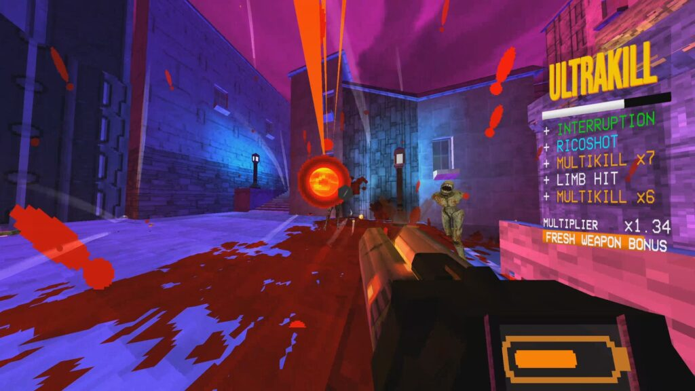
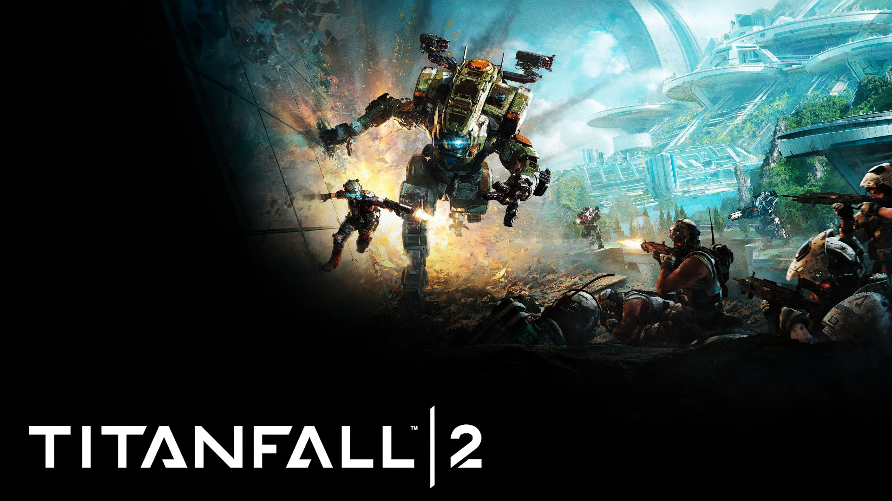
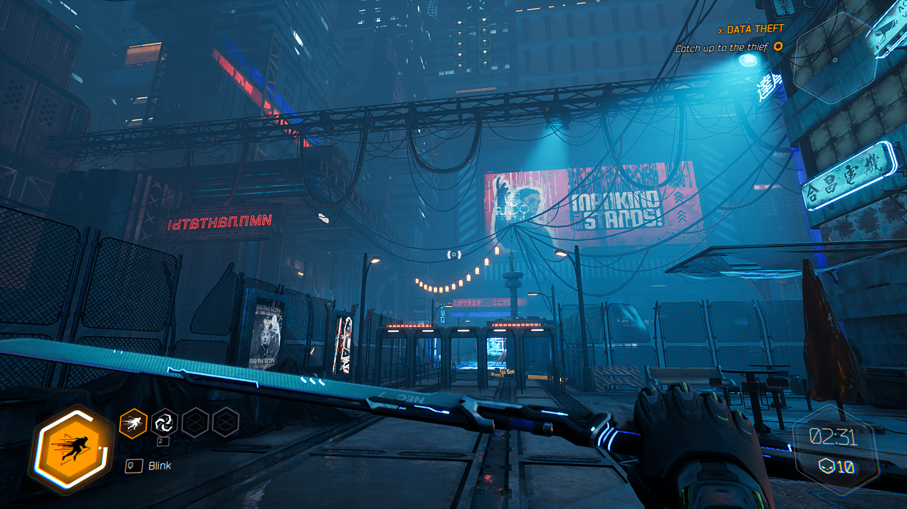

# Overview
PROJECT HUNTER is a first-person, melee combat, arena battle / platformer. Players will navigate through platforming puzzles, arena battles, and boss fights in this game.

# Inspiration & feel of the game
PROJECT HUNTER is inspired by indie games in the "boomer shooter" genre such as ULTRAKILL, DOOM (2016), DOOM ETERNAL, Boomerang X, and platformer elements games such as Neon White, Mirror's Edge, Titanfall 2, Ghostrunner.

The initial inspiration for the game came from playing Ghostrunner, and wanting more from the melee combat presented in the game. Then playing ULTRAKILL gave more inspirations on what gameplay style I wanted to emulate. The game is intended to give the players feeling like an unstoppable canonball bouncing around the arena, taking out everything in their path.

# Core gameplay loop
## Player abilities
Players are equipped with multitude of abilities and weapons. These will be given to the players bit by bit across the levels to help players get used to them.
### General overview
The core focus of the game is the interplay between mobility and combat. Many abilities will be usable for both cases. Game will feature verticality, platforming, and fast-paced combat with dodging projectiles and enemies themselves.

### Mobility
Players will be equipped with multiple mobility options.
- Basic mobility:
  - Double jump
  - High amount of control on the air.
  - High speed movement on-ground.
  - Wall-climb (Genji from Overwatch) & mantling
  - Wallrunning (Titanfall & Ghostrunner)
  - Wall jump
  - Slide which preserves player's momentum and adds speed.
  - Slam, pressing crouch in the air will have the player slam the ground, damaging and/or stunning and/or throwing enemies in the air. 
- Abilities:
  - "Bash" : directional dash that pushes the player on the horizontal axes. Follows the direction of movement input. If player colliders with an enemy, the player will stun the enemy (possibly weaken too). Can use multiple times before needing to wait for cooldown.
  - "Slash" : directional dash that follows the direction player is looking at. Has longer range than Bash. Damages enemies on the path. If enemies are killed through this ability, its cooldown is refreshed. Has higher cooldown than Bash.
  - Grappling hook: Players will be pulled towards a valid grapple target. If the enemy pulled are low-mass enemy, they are pulled towards the player instead. This will give players some float time in the air.
    - Potential to add a function so holding the grapple button will let the players swing, and tapping pulls them towards the target. Subject to change depending on the difficulty of implementation and balance of the game.

### Combat
Player will be equipped with combat tools. Players will be equipped with one or two weapons and can mix and match whichever weapons they want. Players will be able to press a hotkey and a hand button to assign said weapon to the respective hand.
- Generic sword: Close range, the benchmark weapon for all enemies. Most enemies will die in 1 hit from this weapon. Can parry projectiles and attacks with this weapon. 
- Chainsword: Similar to Blades of Chaos from God of War series. Short dagger attached to chains. Longer range from the sword, slower attack speed. same damage. 
  - May link grappling hook mechanics to the weapon. Playtest required.
- Two handed weapon: A hammer or a greatsword. BFG-like weapon that deals massive damage (AoE or otherwise) and goes on a cooldown after use. The weapon will continue cooling down when not in use.Doom eternal.jpg
- Projectile weapon: Depending on testing and balance, a weapon that can shoot projectiles will be added to deal with low number of enemies at distance. However, as the game is melee-focused, this weapon will be low damage and limited in use for this mode. Likely going to be a charge attack function of one of the weapons listed.

Additionally, players will be able to regain health from combat. Damaging enemies in close-range will let players re-gain health. Harder enemies will grant more health.

## Enemy designs

### Common enemy
- Basic grunt
  - Beelines straight towards the enemy. 
  - Deal relatively low damage. 
  - Spawns in high numbers. 
  - Can be led to jump off of platforms.
- Simple projectile enemy: 
  - Throws relatively slow projectile towards the player. 
  - The enemy will track the player until the moment they shoot the projectile. 
  - Non-tracking projectile.
  - Melee attack when in close range.
### Uncommon enemy
- Shield charger
  - Charges in with a shield.
  - Not damageable from the front.
  - Slow to turn around.
  - Guard breaks through the stun mechanic (bash, ground slam, etc).
  - Stops for a moment after missing a charge.
  - Charge cannot be parried
- Samurai
  - Slowly walks towards the player
  - Always has guard on.
    - Attacking in the "guard" mode will disarm the player and trigger an attack. Player will not be able to act during this. Player is able to dodge out of this.
    - Being near the enemy for a duration will have this enemy attack. The enemy will be open to be attacked during this window.
    - Stuns will break them out of guard.
    - Parries will be additionally effective against them.
- Shell shooter
  - Shoots projectiles at the player
  - Enters a defense mode when too close. Has a delay in this transition. Running up to them will not be fast enough to reach them before it enters this mode. Dashes will be quick enough. Most attacks will not work against this enemy during this mode. 
  - When at distance, the enemy will open up to start shooting projectiles. Needs to be damaged in this state most of the time.
  - Intended to be eliminated through the projectile weapon, or in conjunction with the dashes.
  - Can be stunned if it's in its attack state.
- Explosive enemy
  - Walks up to the player to plant itself to the ground and explode.
  - Also damages enemies.
  - Enough time to run away if the player notices it on time.
  - Attacking it will force the explosion. (damaging the player).
  - Bashes will stun then trigger the explosion countdown.
  - Intended to be cleared with the projectile weapon or in conjunction with the dashes.
### Boss enemies
- Large armored boss
  - Unable to be damaged at the first phase. Its armors must be shed off through hitting its weakpoints first.
  - Slow turnaround speed. multiple weak stops around the body.
  - After the armors are off, boss becomes faster, but able to be damaged.
  - Attacks can be parried.
  - Can enter block mode. Arms must be attacked and stunned to break the guard.
  

## Level design overview
Players will be put into two general types of rooms, Arenas and Corridors. 
- Arenas are a combat challenge. They have focus on clearing out the enemies inside the Arena. They will be locked within the zone until all enemies are eliminated.
- Corridors are platforming challenge. They have focus on platforming and navigating the space using the tools the player has.
  - Certain areas will require the player to use dash resets, jump dashes, or grappling hooks to navigate the area.

# Style and story

## Story
The player wakes up in the realm of an "outer god", powers like a cosmic horror entity, who creates a dimension in the image of Buddhist hell, and sends down warriors of different time and dimension to go through the gauntlet they created. The player is one of such subjects of their entertainment. Players will encounter different mythological and historical heroes and warriors throughout this journey, and discover the true intent behind the creation of this dimension and fight through it for their own survival.

## Model and fidelity
The models similar to those on a PS1, PS2 era low-poly models for the enemies, similar to ULTRAKILL.

## Art inspiration
Buddhist hell imagery

